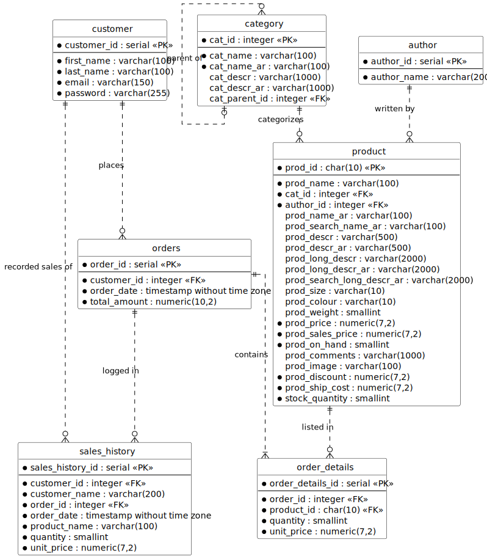

## E-commerce Database Schema Documentation

This document outlines the conceptual and logical design for the e-commerce database, focusing on products, customers, orders, and sales history.

The database is built with PostgreSQL as the target vendor, utilizing its specific features (like `PL/pgSQL` for the trigger) while maintaining a generally clean, normalized structure.

-----

## 1. Entity-Relationship Diagram (ERD)

The diagram below includes the `CatId` Foreign Key in the `Product` table and the new denormalized `SalesHistory` table.



## 2. SQL DDL (Table Creation)

The following scripts create the necessary tables in a PostgreSQL environment.

```sql
-- Disable referential integrity checks temporarily for dependent tables
SET session_replication_role = 'replica';

-- 1. Table Category (Self-referencing)
CREATE TABLE category (
    cat_id       INTEGER GENERATED ALWAYS AS IDENTITY PRIMARY KEY,
    cat_name     VARCHAR(100) NOT NULL,
    cat_name_ar  VARCHAR(100) NOT NULL,
    cat_descr    VARCHAR(1000),
    cat_descr_ar VARCHAR(1000),
    cat_parent_id INTEGER,
    
    CONSTRAINT fk_category_parent FOREIGN KEY (cat_parent_id) REFERENCES category(cat_id)
);

-- 2. Table Author
CREATE TABLE Author (
    author_id     INTEGER GENERATED ALWAYS AS IDENTITY PRIMARY KEY,
    author_name   VARCHAR(200) NOT NULL
);

-- 3. Table Product
CREATE TABLE product (
    prod_id                  CHAR(10) PRIMARY KEY,          -- Using CHAR(10) as specified
    cat_id                   INTEGER NOT NULL,              -- FK to Category
    prod_name                VARCHAR(100) NOT NULL,
    author_id                INTEGER NOT NULL,              -- FK to Author
    prod_name_ar             VARCHAR(100),
    prod_search_name_ar      VARCHAR(100),
    prod_descr               VARCHAR(500),
    prod_descr_ar            VARCHAR(500),
    prod_long_descr          VARCHAR(2000),
    prod_long_descr_ar       VARCHAR(2000),
    prod_search_long_descr_ar VARCHAR(2000),
    prod_size                VARCHAR(10),
    prod_colour              VARCHAR(10),
    prod_weight              SMALLINT,
    prod_price               NUMERIC(7,2) NOT NULL,
    prod_sales_price         NUMERIC(7,2) NOT NULL,
    prod_on_hand             SMALLINT NOT NULL,
    prod_comments            VARCHAR(1000),
    prod_image               VARCHAR(100),
    prod_discount            NUMERIC(7,2) NOT NULL,
    prod_ship_cost           NUMERIC(7,2) NOT NULL,
    stock_quantity           SMALLINT NOT NULL,
    
    CONSTRAINT fk_product_category FOREIGN KEY (cat_id) REFERENCES category(cat_id),
    CONSTRAINT fk_product_author FOREIGN KEY (author_id) REFERENCES author(author_id)
);

-- 4. Table Customer
CREATE TABLE Customer (
    customer_id     INTEGER GENERATED ALWAYS AS IDENTITY PRIMARY KEY,
    first_name      VARCHAR(100) NOT NULL,
    last_name       VARCHAR(100) NOT NULL,
    email           VARCHAR(150) NOT NULL UNIQUE,
    password        VARCHAR(255) NOT NULL
);

-- 5. Table Order
CREATE TABLE "Order" (
    order_id        INTEGER GENERATED ALWAYS AS IDENTITY PRIMARY KEY,
    customer_id     INTEGER NOT NULL,
    order_date      TIMESTAMP WITH TIME ZONE NOT NULL DEFAULT CURRENT_TIMESTAMP,
    total_amount    NUMERIC(10,2) NOT NULL,
    
    CONSTRAINT fk_order_customer FOREIGN KEY (customer_id) REFERENCES Customer(customer_id)
);

-- 6. Table Order_details (The intersection table)
CREATE TABLE Order_details (
    order_details_id    INTEGER GENERATED ALWAYS AS IDENTITY PRIMARY KEY,
    order_id            INTEGER NOT NULL,
    product_id          CHAR(10) NOT NULL,
    quantity            SMALLINT NOT NULL,
    unit_price          NUMERIC(7,2) NOT NULL,
    
    CONSTRAINT fk_order_details_order FOREIGN KEY (order_id) REFERENCES "Order"(order_id),
    CONSTRAINT fk_order_details_product FOREIGN KEY (product_id) REFERENCES Product(ProdID),
    CONSTRAINT uq_order_product UNIQUE (order_id, product_id) -- Prevent duplicate products on an order
);

-- 7. Table SalesHistory (Denormalized log/history)
CREATE TABLE SalesHistory (
    sales_history_id    INTEGER GENERATED ALWAYS AS IDENTITY PRIMARY KEY,
    customer_id         INTEGER NOT NULL,
    customer_name       VARCHAR(200) NOT NULL, -- Snapshot of name at time of sale
    order_id            INTEGER NOT NULL,
    order_date          TIMESTAMP WITH TIME ZONE NOT NULL, -- Snapshot of date
    product_name        VARCHAR(100) NOT NULL, -- Snapshot of name at time of sale
    quantity            SMALLINT NOT NULL,
    unit_price          NUMERIC(7,2) NOT NULL,
    
    -- Foreign keys for traceability, but not strictly needed for a history/log table
    CONSTRAINT fk_history_customer FOREIGN KEY (customer_id) REFERENCES Customer(customer_id),
    CONSTRAINT fk_history_order FOREIGN KEY (order_id) REFERENCES "Order"(order_id)
);

-- Re-enable referential integrity checks
SET session_replication_role = 'origin';
```

-----

## 3. PostgreSQL Trigger for SalesHistory

The `SalesHistory` table will be automatically populated by a **PostgreSQL Trigger** that fires immediately after a new record is successfully inserted into the `Order_details` table.

### A. Create Trigger Function (PL/pgSQL)

This function joins the newly inserted `Order_details` record (`NEW`) with the `Order`, `Customer`, and `Product` tables to capture all required denormalized data for the history log.

```sql
CREATE OR REPLACE FUNCTION log_sales_history()
RETURNS TRIGGER AS $$
BEGIN
    -- Insert a record into SalesHistory by joining all necessary tables
    -- The NEW keyword refers to the data just inserted into Order_details
    INSERT INTO SalesHistory (
        customer_id,
        customer_name,
        order_id,
        order_date,
        product_name,
        quantity,
        unit_price
    )
    SELECT
        C.customer_id,
        C.first_name || ' ' || C.last_name, -- Concatenate for the full name snapshot
        O.order_id,
        O.order_date,
        P.ProdName,
        NEW.quantity,
        NEW.unit_price
    FROM 
        "Order" O
    JOIN 
        Customer C ON O.customer_id = C.customer_id
    JOIN 
        Product P ON NEW.product_id = P.ProdID
    WHERE 
        O.order_id = NEW.order_id; -- Link back to the parent order
    
    RETURN NEW;
END;
$$ LANGUAGE plpgsql;
```

### B. Create Trigger

This attaches the function to the `Order_details` table.

```sql
CREATE TRIGGER sales_history_trigger
AFTER INSERT ON Order_details
FOR EACH ROW
EXECUTE FUNCTION log_sales_history();
```

---
# Queries

## 1. Daily Revenue Report for a Specific Date

This query calculates the total revenue from all confirmed orders on a single, specified date.

### SQL Query

```sql
SELECT
    DATE_TRUNC('day', O.order_date) AS report_date,
    SUM(O.total_amount) AS total_daily_revenue
FROM
    "Order" O
WHERE
    -- Filter for a specific date (e.g., '2025-10-27')
    O.order_date::date = DATE '2025-10-27' 
GROUP BY
    report_date;

-- NOTE: In PostgreSQL, you can use the ::date cast for efficient date comparison.
-- For standard SQL portability, use: 
/*
WHERE O.order_date >= DATE '2025-10-27'
  AND O.order_date < DATE '2025-10-27' + INTERVAL '1' DAY
*/
```

-----

## 2. Monthly Top-Selling Products Report

This query identifies the top products based on the **total revenue** they generated (Unit Price \* Quantity) within a given month, as requested ("most price even with less quantity").

### SQL Query

```sql
SELECT
    P.ProdID,
    P.ProdName,
    SUM(OD.quantity * OD.unit_price) AS total_product_revenue
FROM
    Order_details OD
JOIN
    "Order" O ON OD.order_id = O.order_id
JOIN
    Product P ON OD.product_id = P.ProdID
WHERE
    -- Filter for a specific month (e.g., November 2025)
    DATE_TRUNC('month', O.order_date) = DATE '2025-11-01' 
GROUP BY
    P.ProdID, P.ProdName
ORDER BY
    total_product_revenue DESC
LIMIT 10; -- Adjust the limit to specify how many "top" products to show
```

-----

## 3. High-Value Customer Report (Past Month) [Complex Query]

This complex query retrieves the names and total order amounts of customers whose orders exceeded a cumulative total of **$500** in the last **30 days** (or "past month").

### SQL Query

```sql
SELECT
    C.first_name || ' ' || C.last_name AS customer_full_name,
    SUM(O.total_amount) AS total_order_amount
FROM
    "Order" O
JOIN
    Customer C ON O.customer_id = C.customer_id
WHERE
    -- Filter orders placed in the last 30 days
    O.order_date >= CURRENT_DATE - INTERVAL '30' DAY 
GROUP BY
    C.customer_id, C.first_name, C.last_name
HAVING
    -- Filter out customers whose total revenue in that period is NOT > $500
    SUM(O.total_amount) > 500.00
ORDER BY
    total_order_amount DESC;
```

That's an excellent set of queries focused on searching and recommendation logic for your e-commerce database.

Here are the answers and designed queries, addressing the functionality you requested.

-----

## 4. Product Search (Full-Text Emulation)

Since we are using **PostgreSQL**, the standard and most powerful way to achieve this is using the `ILIKE` operator for simple substring searching or, ideally, PostgreSQL's built-in **Full-Text Search (FTS)** features.

### PostgreSQL Query (Basic Substring Search)

This uses the standard `ILIKE` operator, which is case-insensitive in PostgreSQL and is more portable than vendor-specific FTS syntax.

```sql
SELECT
    ProdID,
    ProdName,
    ProdDescr
FROM
    Product
WHERE
    -- Check ProdName (case insensitive)
    ProdName ILIKE '%camera%' 
    -- Check ProdDescr (case insensitive)
    OR ProdDescr ILIKE '%camera%'
    -- Check ProdLongDescr (case insensitive)
    OR ProdLongDescr ILIKE '%camera%'
    -- Optionally check translated fields if needed
    OR ProdNameAr ILIKE '%camera%';
```

OR **Full-Text Search (FTS)**
```sql
Select *
from Product 
where 
Match(ProdName,ProdDesc,ProdLogDescr) Against('camera');
``` 


-----

## 5. Suggest Popular Products in the Same Category

This query addresses the core recommendation logic: "Users who bought X also liked these other items in the same category."

We will find the products of the same category then exclude the purchased ones.

### SQL Query (Same Category Recommendation)

```sql
SELECT 
    p.product_id, 
    p.product_name, 
    p.category_id
FROM Products p
WHERE p.category_id IN (
    SELECT DISTINCT category
    FROM Products
    WHERE product_id IN (
        SELECT product_id 
        FROM SalesHistory
        WHERE customer_id = <customer_id>
    )
)
AND p.product_id NOT IN (
    SELECT product_id
    FROM SalesHistory
    WHERE customer_id = <customer_id>
);
```

-----

## 6. Suggest Popular Products by the Same Category and Author

```sql
SELECT 
    p.product_id, 
    p.product_name, 
    p.category_id
FROM Products p
WHERE p.category_id IN (
    SELECT DISTINCT category
    FROM Products
    WHERE product_id IN (
        SELECT product_id 
        FROM SalesHistory
        WHERE customer_id = <customer_id>
    )
)
AND p.author IN (
    SELECT DISTINCT author
    FROM Products
    WHERE product_id IN (
        SELECT product_id
        FROM SalesHistory
        WHERE customer_id = <customer_id>
    )
)
AND p.product_id NOT IN (
    SELECT product_id
    FROM SalesHistory
    WHERE customer_id = <customer_id>
);
```